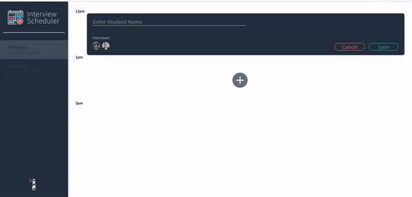

# Interview Scheduler

## Setup

Install dependencies with `npm install`.

## Running Webpack Development Server

```sh
npm start
```

## Running Jest Test Framework

```sh
npm test
```

## Running Storybook Visual Testbed

```sh
npm run storybook
```

## About
Interview Scheduler is an app designed to create/edit/delete appointments.  Simply choose the day you want to book and appointment and click the add button, from there you will given a name to save to the appointment, from there you can choose from a list of interviewers available.



